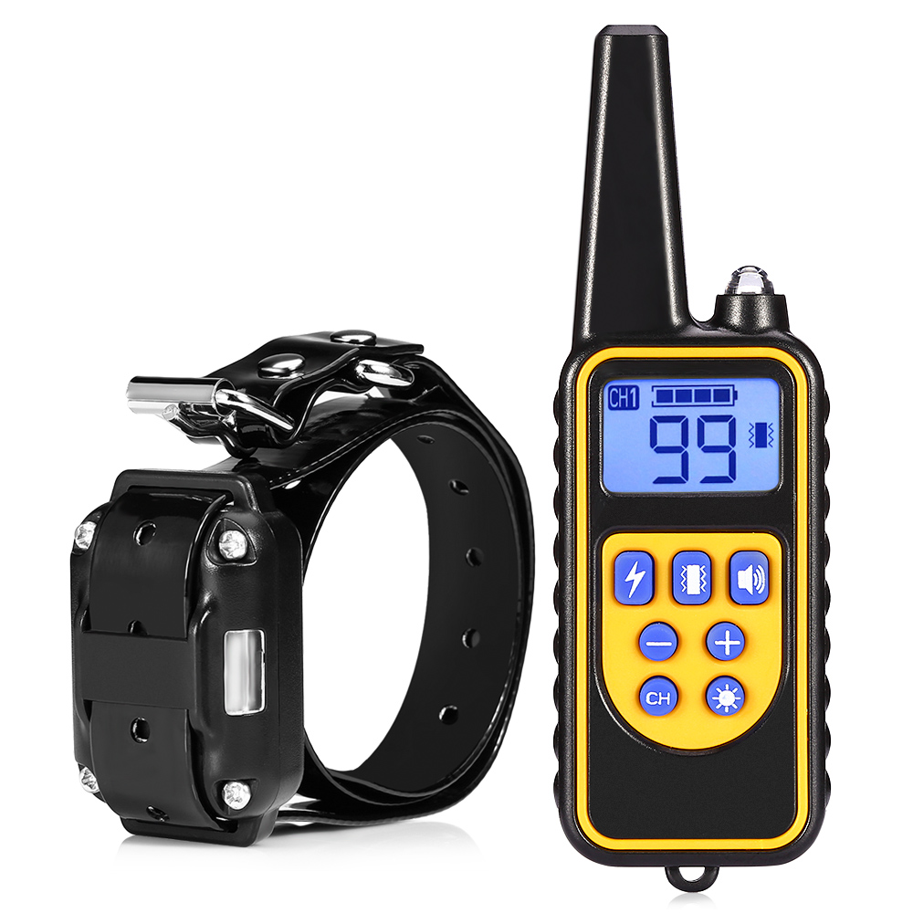

# Collar de Estimulación

En este proyecto mostramos como clonar el control de un collar de adiestramiento que tiene opciones de estimulos por vibracion, sonido e impulsos electricos.

## Captura de la señal

Para esto usamos el [Trainer 3](https://mundomascotas.com.ar/tienda/collar-de-adiestramiento-para-perros/trainer-3/) y el [flipper zero](https://en.wikipedia.org/wiki/Flipper_Zero) que amablemente nos prestaron Matt y Gia respectivamente.

[KinkyToyMaker](https://www.instagram.com/kinkytoymaker/?hl=en) grabó las señales que estan en la carpeta `subs`.



Compramos el collar sin control [acá](https://mundomascotas.com.ar/tienda/collares-extras/collar-extra-trainer3/)

## Hardware

Compramos distintos modulos RF de 433 MHZ para OOK y lo conectamos a una ESP32. Para debuggear y lograr que termine de funcionar todo nos guiamos de [este tutorial](https://youtu.be/LbCDpbWrdlQ?si=hX0qrkrM-xSeYEQN), el cual plantea conectar a la placa de sonido el receptor para grabar las señales que se reciben y comparar las del control que se quiere clonar con la de nuestro emisor.

- https://www.mercadolibre.com.ar/modulo-rf-transmisor-y-receptor-433-mhz-arduino/p/MLA32487770#polycard_client=search-nordic&searchVariation=MLA32487770&wid=MLA1665965578&position=11&search_layout=stack&type=product&tracking_id=eee82f79-bf93-46d6-a4bf-ca5ad650e982&sid=search
    - De este anduvo el receptor y no el transmisor

- https://articulo.mercadolibre.com.ar/MLA-780605460-emisor-receptor-superheterodino-433-armodltxrxwl102-_JM?quantity=1
    - De este anduvo el transmisor y no el receptor

## Sketches ESP32

| Carpeta | Descripción |
|---|---|
| `src/Telegram_Bot` | Control por comandos de Telegram sobre WiFi |
| `src/BLE_Keyboard` | Dispara shocks al presionar teclas en un teclado BLE HID |
| `src/Dual_Mode` | **Fusión de ambos** — switchea entre modos con el botón BOOT |

### Dual_Mode — cómo switchear de modo

| Acción al encender | Resultado |
|---|---|
| No tocar nada | Arranca en el modo guardado (Telegram por defecto) |
| Mantener BOOT < 2 s y soltar | Cambia de modo (Telegram ↔ BLE Keyboard), guarda y reinicia |
| Mantener BOOT ≥ 2 s | Borra credenciales WiFi guardadas y reinicia |

El LED parpadea rápido mientras se sostiene el botón para confirmar que fue registrado.

### Compilar y subir

`Dual_Mode` requiere el esquema `huge_app` (WiFi + BLE juntos no entran en la partición por defecto):

```bash
~/.local/bin/arduino-cli compile \
  --fqbn "esp32:esp32:esp32:PartitionScheme=huge_app" \
  --upload --port /dev/ttyUSB0 \
  "src/Dual_Mode"
```

Para los sketches individuales:

```bash
~/.local/bin/arduino-cli compile \
  --fqbn esp32:esp32:esp32 \
  --upload --port /dev/ttyUSB0 \
  "src/Telegram_Bot"   # o src/BLE_Keyboard
```

## Proyectos Relacionados

- https://pishock.com/
- https://openshock.org/
    - https://wiki.openshock.org/hardware/shockers/caixianlin
- https://github.com/Nat-the-Kat/caixianlin_remote_shocker
